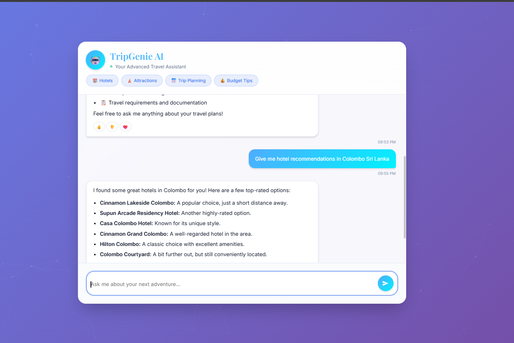

# TripGenie AI 🧞✈️
Hosted url: https://tripgenie-ai-900983812407.asia-south1.run.app

TripGenie AI is an intelligent, conversational travel assistant designed to make trip planning effortless and intuitive. Powered by Google's Gemini Pro model, TripGenie understands natural language to help users discover hotels and tourist attractions around the world.

The application leverages the Amadeus Self-Service APIs for real-time travel data and is built with a modern FastAPI backend, making it both powerful and scalable.

 

## ✨ Key Features

- **Conversational Interface**: Interact with the assistant in a natural, human-like way.
- **Context-Aware Memory**: TripGenie remembers the last city you talked about. Ask "Find me hotels" and then "what about attractions?" and it will know you're still talking about the same city.
- **Intent Recognition**: Intelligently understands whether you're looking for hotels, attractions, or just having a general chat.
- **Real-Time Travel Data**: Integrates with the **Amadeus API** to fetch up-to-date information on:
    - Hotels
    - Points of Interest
- **Simple Frontend**: A clean HTML and JavaScript interface to interact with the chatbot ( For Demonstration purpose).
- **Modern Tech Stack**: Built with Python, FastAPI, and Google's Gemini  for a high-performance, asynchronous backend.

## 🛠️ Tech Stack & Architecture

- **Frontend**: **HTML, CSS, JavaScript** for demonstration purpose.
- **Backend**: **FastAPI**
- **LLM**: **Google Gemini** for intent detection and response generation.
- **Travel Data**: **Amadeus for Developers Self-Service API**
- **Core Language**: **Python**
- **Schema Validation**: **Pydantic**

The application works in the following sequence:
1.  A user sends a message.
2.  The FastAPI backend receives the request.
3.  The **Gemini** model analyzes the message and chat history to determine the user's `intent` (e.g., `search_hotels`) and `city`.
4.  If a city is identified, the application calls the **Amadeus API** to get a city code and relevant data (hotels or attractions).
5.  The fetched data is combined with the original user question into a new prompt for Gemini.
6.  Gemini generates a friendly, conversational response based on the data.
7.  The final response is streamed back to the user.

## 🚀 Getting Started

Follow these instructions to set up and run the project locally.

### Prerequisites

- Python 3.9+
- An active virtual environment (recommended)
- API keys for:
    - **Google (Gemini)**
    - **Amadeus for Developers**

### 1. Clone the Repository

```bash
git clone https://github.com/RaviyaLK/TripGenie-AI.git
cd TripGenie-AI
```

### 2. Set Up a Virtual Environment

```bash
# For Unix/macOS
python3 -m venv venv
source venv/bin/activate

# For Windows
python -m venv venv
.\venv\Scripts\activate
cd TripGenie-AI
```

### 3. Install Dependencies

Install all the required Python packages.

```bash
pip install -r requirements.txt
```

### 4. Configure Environment Variables

Create a .env file in the root directory of the project. This file will store your secret API keys.

```bash
GEMINI_API_KEY="YOUR_GOOGLE_GEMINI_API_KEY"
AMADEUS_API_KEY="YOUR_AMADEUS_CLIENT_ID"
AMADEUS_API_SECRET="YOUR_AMADEUS_CLIENT_SECRET"
```

### 5. Run the Application

Start the FastAPI server using Uvicorn.

```bash
uvicorn main:app --reload
```

### 6. Access the API

The API will be running at http://127.0.0.1:8000. You can access the interactive API documentation (powered by Swagger UI) at:
http://127.0.0.1:8000/docs. 
Update: Now it has hosted on Google cloud run, You can access the interactive API documentation at: https://tripgenie-ai-900983812407.asia-south1.run.app/docs and also You can access the chatbot UI using https://tripgenie-ai-900983812407.asia-south1.run.app. 

### 7. View the Frontend with Live Server

To interact with the chatbot, open the user interface in your browser.

- Make sure you have the Live Server extension installed in VS Code.
- In the VS Code file explorer, navigate to the frontend directory.
- Right-click on the index.html file.
- Select "Open with Live Server" from the context menu.

This will automatically open a new tab in your default web browser (e.g., at http://127.0.0.1:5500/static/index.html) where you can start chatting with TripGenie AI.

## 🌟 Future Improvements

- Enhance the frontend interface with a modern framework like React or Vue.
- Add more travel-related intents (e.g., find_flights, book_tours).
- Implement user authentication and persistent chat history.
